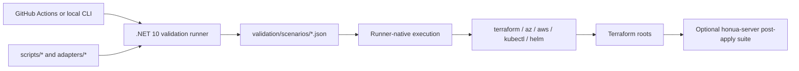

# Terraform Validation Runbook

This runbook is for maintainers operating Terraform validation in CI and from local workstations.

## Architecture



## Runner vs Wrapper Boundary

- The runner is the canonical orchestration contract.
- GitHub workflows should call the runner directly.
- `scripts/*` and `validation/adapters/*` remain stable shell entrypoints for compatibility.
- `validation/scripts/*` is private implementation detail, not the long-term public interface.

Current status:

| Scenario | Status |
|---|---|
| `static-validate` | runner-native |
| `policy-gates` | runner-native |
| `drift` | runner-native |
| `k8s-live` | runner-native |
| `aks-live` | runner-native |
| `eks-live` | runner-native |
| `azure-live` | runner-native |
| `aws-live` | runner-native |

## Scenario Coverage

| Scenario | Terraform roots covered |
|---|---|
| `static-validate` | bootstrap roots, all example roots, all module roots |
| `policy-gates` | `infrastructure/terraform/examples/*` and `modules/*` |
| `azure-live` | `examples/azure`, `examples/azure-functions`, and supporting `examples/azure-data` reuse when configured |
| `aws-live` | `examples/aws`, `examples/aws-serverless`, and supporting `examples/aws-data` reuse when configured |
| `k8s-live` | shared local Kubernetes harness plus `examples/observability` |
| `aks-live` | `examples/azure-aks`, then shared Kubernetes validation flow |
| `eks-live` | `examples/aws-eks`, then shared Kubernetes validation flow |
| `drift` | app roots by default; managed roots when `--run-aks true` / `--run-eks true` |

## Workflow Entry Point

Primary workflow: `.github/workflows/terraform-manual-validation.yml`

Important dispatch controls:

- `cloud`: `both|azure|aws`
- `deployment_profile`: `ephemeral|persistent`
- `apply_confirmation`: must be `APPROVED` for persistent applies
- `run_live`, `run_k8s`, `run_aks`, `run_eks`, `run_drift`
- `no_destroy`
- `allow_destroy_plan`

The workflow also checks out `honua-server` for live jobs that need the cross-repo platform suite or the shared Kubernetes/Helm assets.

## Required Secrets

Common:

- `HONUA_ADMIN_PASSWORD`
- `HONUA_DB_PASSWORD`

Azure live / AKS:

- `ARM_CLIENT_ID`
- `ARM_CLIENT_SECRET`
- `ARM_TENANT_ID`
- `ARM_SUBSCRIPTION_ID`

AWS live / EKS:

- `AWS_ACCESS_KEY_ID`
- `AWS_SECRET_ACCESS_KEY`
- `AWS_SESSION_TOKEN` if your auth flow requires it

## Important Repository Variables

Image references:

- `HONUA_ACA_IMAGE`, `HONUA_FUNCTIONS_IMAGE`
- `HONUA_AWS_ECS_IMAGE`, `HONUA_AWS_SERVERLESS_IMAGE`
- `HONUA_K8S_IMAGE`
- matching `*_PREVIOUS_IMAGE` variables for upgrade/rollback scenarios

Behavior controls:

- `HONUA_AZURE_VALIDATION_STACK`
- `HONUA_AWS_VALIDATION_STACK`
- `HONUA_MAX_RUN_COST_USD`
- `HONUA_READY_SLO_SECONDS`
- `HONUA_MAX_LOAD_ERROR_RATE_PERCENT`
- `HONUA_TTL_HOURS`
- `HONUA_SKIP_DB_RESILIENCE`
- `HONUA_SKIP_QUOTA_PREFLIGHT`
- `HONUA_SKIP_HELM_STATIC_VALIDATION`
- `HONUA_SKIP_OBSERVABILITY`
- `HONUA_SKIP_IDEMPOTENCY`
- `HONUA_SKIP_PROTOCOL_CHECKS`
- `HONUA_SKIP_SCALE_CHECK`
- `HONUA_RUN_UPGRADE_ROLLBACK`

## Local Entry Points

Use the runner directly for new local automation:

```bash
dotnet run --project infrastructure/terraform/validation/runner/Honua.TerraformValidation.Runner -- \
  static-validate

dotnet run --project infrastructure/terraform/validation/runner/Honua.TerraformValidation.Runner -- \
  policy-gates \
  --strict true

dotnet run --project infrastructure/terraform/validation/runner/Honua.TerraformValidation.Runner -- \
  drift \
  --cloud both \
  --run-aks true \
  --run-eks true

dotnet run --project infrastructure/terraform/validation/runner/Honua.TerraformValidation.Runner -- \
  aks-live \
  --deployment-profile ephemeral \
  --apply-confirmation "" \
  --allow-destroy-plan false \
  --no-destroy false

dotnet run --project infrastructure/terraform/validation/runner/Honua.TerraformValidation.Runner -- \
  eks-live \
  --deployment-profile ephemeral \
  --apply-confirmation "" \
  --allow-destroy-plan false \
  --no-destroy false
```

Keep compatibility wrappers only when you need stable shell invocations:

- `./scripts/run-aks-terraform-integration.sh`
- `./scripts/run-eks-terraform-integration.sh`
- `./scripts/run-k8s-terraform-integration.sh`
- `./scripts/run-aws-terraform-integration.sh`
- `./scripts/run-azure-terraform-integration.sh`

## Troubleshooting

| Symptom | Likely cause | Checks |
|---|---|---|
| Persistent run is rejected immediately | approval gate not satisfied | confirm `--apply-confirmation APPROVED` |
| `azure-live` or `aws-live` fails after Terraform apply | optional external platform-validation handoff or runtime-level verification failed | inspect runner output, uploaded plans, and the `honua-server` post-apply suite logs if `HONUA_PLATFORM_VALIDATION_SCRIPT` was set |
| AKS/EKS runner fails before k8s checks | bootstrap creds, plan guard, or cluster CLI auth | check Terraform plan artifact, `az login`/`aws sts get-caller-identity`, quota guard, cluster outputs |
| Shared Kubernetes validation cannot find chart assets | `honua-server` checkout missing | confirm `honua-server` exists beside the repo root or under the workflow checkout path |
| Post-apply platform suite is skipped unexpectedly | `HONUA_PLATFORM_VALIDATION_SCRIPT` missing and auto-discovery failed | verify `honua-server/scripts/run-cloud-post-apply-validation.sh` exists |
| Drift job reports no managed roots | flags omitted | rerun with `--run-aks true` and/or `--run-eks true` |
| Plan apply is refused | destroy actions detected | inspect uploaded plan text and rerun only if `--allow-destroy-plan true` is justified |
| Policy gates differ between local and CI | missing local tools | compare installed `tflint`, `checkov`, `tfsec`, `dotnet`, `terraform` versions |

## Cost Controls for Validation

Use the following levers before widening a scenario:

- keep `deployment_profile=ephemeral` unless you explicitly need persistent resources
- reuse shared data stacks only when the scenario is meant to validate compute against stable data dependencies
- cap runs with `HONUA_MAX_RUN_COST_USD`
- disable expensive optional checks temporarily only when debugging (`HONUA_SKIP_*`)
- avoid `no_destroy=true` unless you are actively debugging teardown or post-apply state

## Known Operational Facts

- All internal Terraform validation scenarios are runner-native at the orchestration layer.
- The only non-native live hook is the optional external `honua-server` platform-validation script invoked after apply.
- `k8s-live` is a shared harness, not a standalone deployable Terraform runtime root.

## Related Docs

- `docs/operator-deployment.md`
- `infrastructure/terraform/validation/README.md`
- `infrastructure/terraform/validation/adapters/README.md`
- `infrastructure/terraform/validation/runner/README.md`
