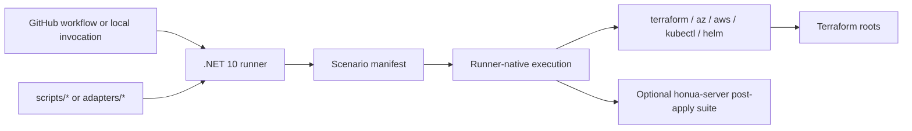

# Terraform Validation Assets

This directory contains maintainer-only validation automation for Terraform roots under `infrastructure/terraform`.

## Architecture

## Boundary Rules

- `validation/runner/*` is the typed orchestration layer.
- `validation/scenarios/*` defines what each scenario is allowed to execute.
- `validation/adapters/*` is the stable wrapper boundary for existing shell entrypoints.
- `validation/scripts/*` is private implementation detail. Treat it as replaceable, not as the long-term public interface.

## Current Scenario Split

| Scenario | Status | Notes |
|---|---|---|
| `static-validate` | runner-native | `terraform fmt`, `init -backend=false`, `validate`, and isolated `terraform test` module roots |
| `policy-gates` | runner-native | `tflint`, `checkov`, optional `tfsec`, custom guard checks |
| `drift` | runner-native | `terraform plan -detailed-exitcode` |
| `k8s-live` | runner-native | cluster prep, Helm validation, observability apply, and app checks are orchestrated in C# |
| `aks-live` | runner-native | bootstrap identity, plan/apply, kubeconfig handoff, Kubernetes checks, cleanup/leak checks are in C# |
| `eks-live` | runner-native | bootstrap identity, plan/apply, kubeconfig handoff, Kubernetes checks, cleanup/leak checks are in C# |
| `azure-live` | runner-native | bootstrap identity, plan/apply, post-apply validation, and cleanup are orchestrated in C# |
| `aws-live` | runner-native | bootstrap identity, plan/apply, post-apply validation, and cleanup are orchestrated in C# |

The only intentional script execution still on the live path is the optional external `honua-server` post-apply suite referenced by `HONUA_PLATFORM_VALIDATION_SCRIPT`.

## Read Next

- Runbook: `docs/devops/terraform-validation.md`
- Runner internals: `infrastructure/terraform/validation/runner/README.md`
- Adapter boundary: `infrastructure/terraform/validation/adapters/README.md`
