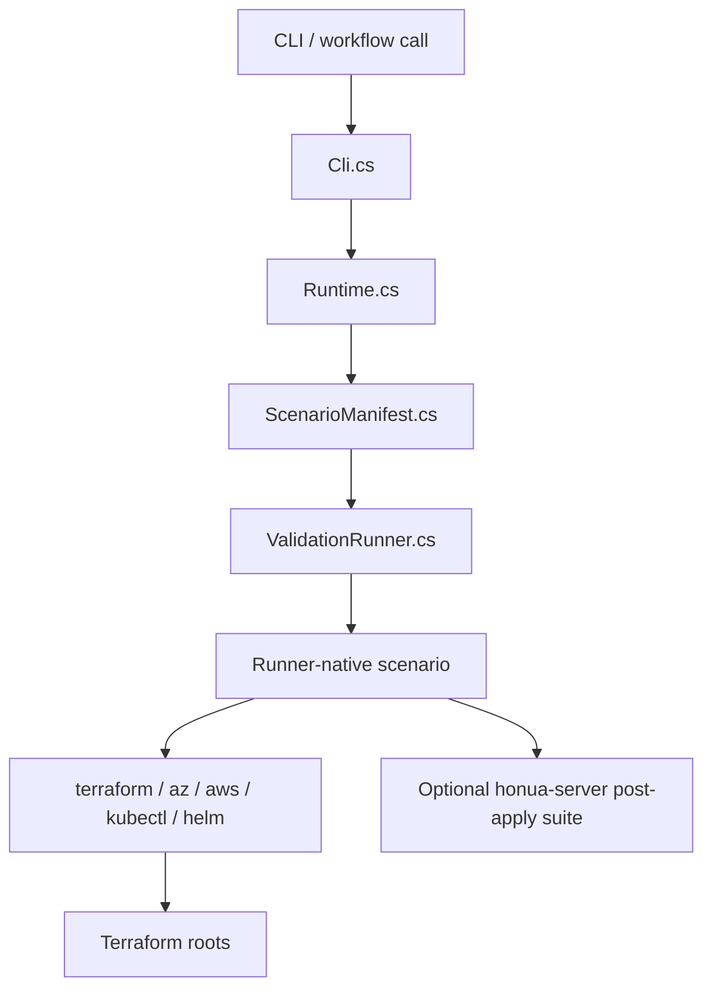

# Terraform Validation Runner

`Honua.TerraformValidation.Runner` is the typed `.NET 10` entrypoint for Terraform validation orchestration.

## What It Owns

- command-line parsing
- scenario selection
- GitHub workflow input validation
- persistent-apply approval enforcement
- bootstrap identity lifecycle for Azure and AWS live scenarios
- runner-native static validation, policy gates, drift detection, live cloud orchestration, and managed-Kubernetes orchestration

It does **not** own only the optional external cross-repo platform-validation suite. When `HONUA_PLATFORM_VALIDATION_SCRIPT` is set or auto-discovered, the live scenarios invoke that script after Terraform apply to exercise `honua-server` deployment behavior end to end.

## Code Map

| File | Responsibility |
|---|---|
| `Program.cs` | process entrypoint and top-level exception handling |
| `Cli.cs` | scenario names, allowed options, usage text, command parsing |
| `Runtime.cs` | repo/temp context, environment reader, process execution helpers |
| `ScenarioManifest.cs` | JSON manifest loading and validation |
| `ValidationRunner.cs` | scenario dispatch plus runner-native static/policy/drift/cloud bootstrap logic |
| `ManagedKubernetesValidation.cs` | runner-native AKS/EKS apply, kubeconfig handoff, destroy, leak checks |

## Flow



## Runner vs Wrapper Boundary

- New workflows should call the runner directly.
- Adapters exist so legacy shell invocations keep working.
- Shell wrappers may translate old flags into runner options, but the runner is the canonical orchestration contract.
- `validation/scripts/*` is not the public API; it remains only as fallback/reference implementation behind wrappers.

## Local Development

Dry-run is the safest first pass when changing orchestration:

```bash
dotnet run --project infrastructure/terraform/validation/runner/Honua.TerraformValidation.Runner -- \
  policy-gates \
  --strict true \
  --dry-run
```

Use the same pattern for `static-validate`, `drift`, `aks-live`, `eks-live`, `azure-live`, `aws-live`, and `k8s-live`.

## Extending the Runner

1. Add or update the scenario in `Cli.cs`.
2. Define or extend the manifest in `validation/scenarios/*.json`.
3. Implement the scenario logic in `ValidationRunner.cs` or a focused companion file.
4. Decide whether the scenario needs any external post-apply hook beyond the runner itself.
5. Update `docs/devops/terraform-validation.md` and the adapter/validation READMEs so the boundary stays explicit.
